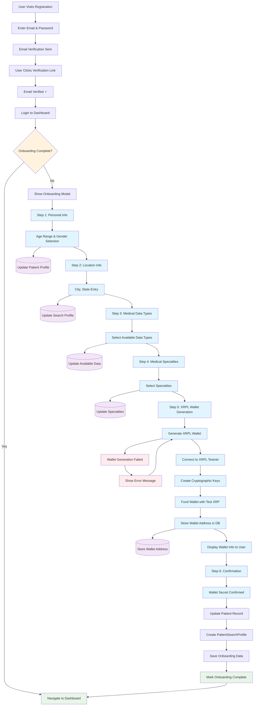
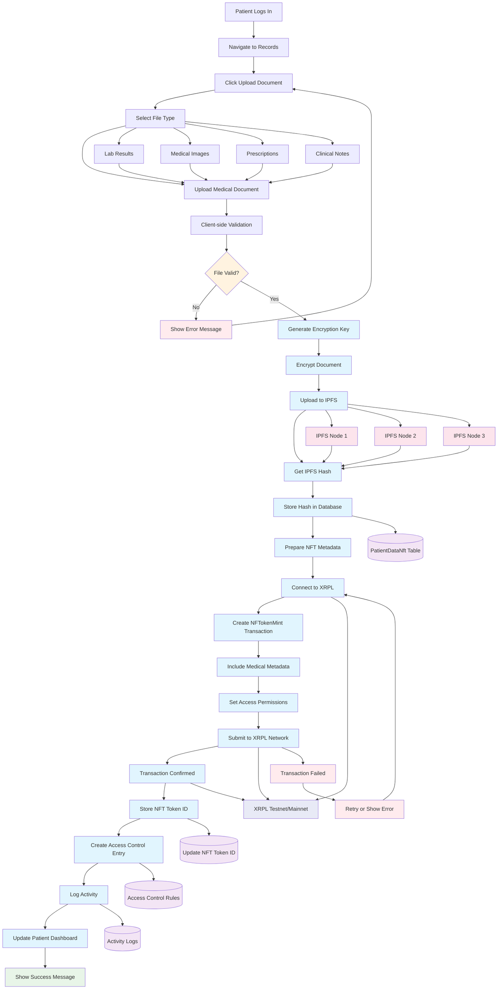
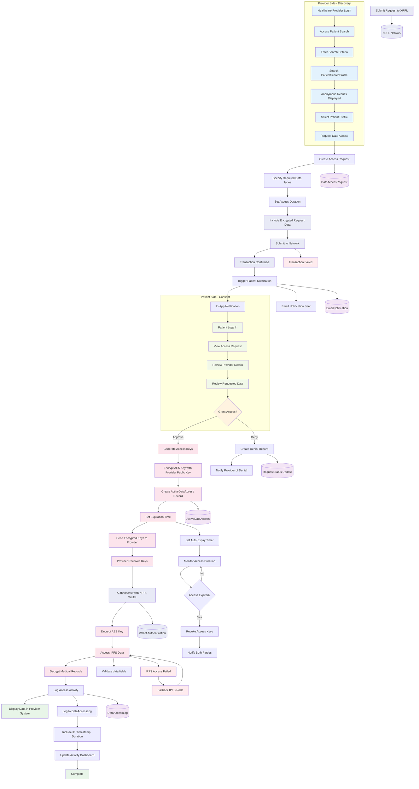
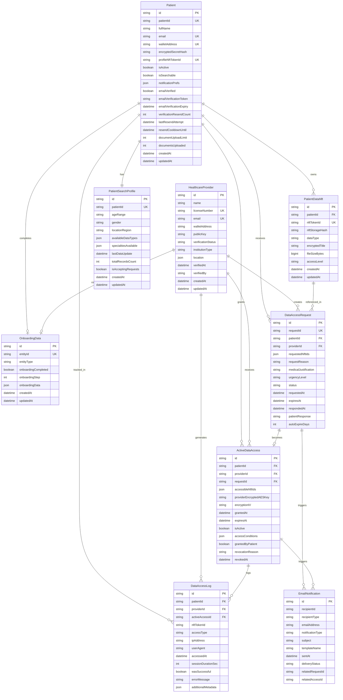

# MedLedger Flow Diagrams

## Technical Architecture & User Journey Visualizations

This document contains 7 comprehensive flow diagrams that illustrate the core technical architecture and user journeys for the MedLedger healthcare data ownership platform.

---

## 1. Patient Onboarding & XRPL Wallet Creation Flow

---

## 2. Medical Record Upload & NFT Minting Flow

---

## 3. Cryptographic Consent Protocol Flow

---

## 4. Database Schema Architecture & Data Flow

---

## 5. Healthcare System Integration & API Architecture Flow

```mermaid
flowchart TD
    %% External Healthcare Systems
    subgraph "Healthcare Ecosystem"
        EHR1[Epic EHR System]
        EHR2[Cerner EHR System]
        EHR3[AllScripts EHR]
        HL7[HL7 FHIR Server]
        DICOM[DICOM Image Server]
        LAB[Laboratory Systems]
        PHARM[Pharmacy Systems]
    end

    %% MedLedger API Gateway
    subgraph "MedLedger API Gateway"
        GATEWAY[API Gateway]
        AUTH[Authentication Service]
        RATE[Rate Limiting]
        LOGS[API Logging]
        TRANSFORM[Data Transformation]
    end

    %% Core MedLedger Services
    subgraph "MedLedger Core Services"
        PATIENT[Patient Service]
        PROVIDER[Provider Service]
        RECORDS[Records Service]
        ACCESS[Access Control Service]
        NOTIFY[Notification Service]
        XRPL_SVC[XRPL Service]
        IPFS_SVC[IPFS Service]
    end

    %% Database Layer
    subgraph "Data Layer"
        POSTGRES[(PostgreSQL Database)]
        REDIS[(Redis Cache)]
        IPFS_CLUSTER[IPFS Cluster]
        XRPL_NET[XRPL Network]
    end

    %% External Integrations
    subgraph "External Services"
        EMAIL[Email Service]
        SMS[SMS Service]
        STRIPE[Stripe Payments]
        SHOPIFY[Shopify Commerce]
    end

    %% Integration Flows
    EHR1 -->|"SMART on FHIR"| GATEWAY
    EHR2 -->|"REST API"| GATEWAY
    EHR3 -->|"SOAP/REST"| GATEWAY
    HL7 -->|"FHIR Resources"| GATEWAY
    DICOM -->|"DICOM Web"| GATEWAY
    LAB -->|"HL7 v2"| GATEWAY
    PHARM -->|"NCPDP"| GATEWAY

    %% API Gateway Processing
    GATEWAY --> AUTH
    AUTH --> RATE
    RATE --> LOGS
    LOGS --> TRANSFORM

    %% Service Routing
    TRANSFORM -->|"Patient Data"| PATIENT
    TRANSFORM -->|"Provider Data"| PROVIDER
    TRANSFORM -->|"Medical Records"| RECORDS
    TRANSFORM -->|"Access Requests"| ACCESS
    TRANSFORM -->|"Notifications"| NOTIFY

    %% Core Service Interactions
    PATIENT --> XRPL_SVC
    PROVIDER --> XRPL_SVC
    RECORDS --> IPFS_SVC
    ACCESS --> XRPL_SVC
    NOTIFY --> EMAIL
    NOTIFY --> SMS

    %% Data Persistence
    PATIENT --> POSTGRES
    PROVIDER --> POSTGRES
    RECORDS --> POSTGRES
    ACCESS --> POSTGRES
    NOTIFY --> POSTGRES

    %% Caching Layer
    PATIENT --> REDIS
    PROVIDER --> REDIS
    ACCESS --> REDIS

    %% Blockchain & Storage
    XRPL_SVC --> XRPL_NET
    IPFS_SVC --> IPFS_CLUSTER

    %% Payment Integration
    ACCESS --> STRIPE
    PROVIDER --> SHOPIFY

    %% Standard Compliance Flows
    subgraph "Compliance Layer"
        HIPAA[HIPAA Compliance]
        GDPR[GDPR Compliance]
        FHIR_COMP[FHIR Compliance]
        HL7_COMP[HL7 Compliance]
    end

    TRANSFORM --> HIPAA
    TRANSFORM --> GDPR
    TRANSFORM --> FHIR_COMP
    TRANSFORM --> HL7_COMP

    %% Real-time Data Flows
    XRPL_NET -.->|"Webhook Events"| NOTIFY
    IPFS_CLUSTER -.->|"Pin Status"| RECORDS
    REDIS -.->|"Cache Updates"| PATIENT

    %% Error Handling & Monitoring
    subgraph "Monitoring"
        ERROR[Error Tracking]
        METRICS[Performance Metrics]
        ALERTS[Alert System]
        AUDIT[Audit Logging]
    end

    GATEWAY --> ERROR
    PATIENT --> METRICS
    PROVIDER --> METRICS
    RECORDS --> METRICS
    ACCESS --> AUDIT

    %% SDK and Developer Tools
    subgraph "Developer Ecosystem"
        SDK_JS[JavaScript SDK]
        SDK_PY[Python SDK]
        SDK_FHIR[FHIR SDK]
        DOCS[API Documentation]
        SANDBOX[Sandbox Environment]
    end

    GATEWAY -.->|"Powers"| SDK_JS
    GATEWAY -.->|"Powers"| SDK_PY
    GATEWAY -.->|"Powers"| SDK_FHIR
    DOCS -.->|"Documents"| GATEWAY
    SANDBOX -.->|"Testing"| GATEWAY

    %% Styling
    classDef healthcare fill:#e8f5e8
    classDef gateway fill:#e1f5fe
    classDef service fill:#f3e5f5
    classDef database fill:#fff3e0
    classDef external fill:#fce4ec
    classDef compliance fill:#e8eaf6
    classDef monitoring fill:#fff8e1
    classDef developer fill:#f1f8e9

    class EHR1,EHR2,EHR3,HL7,DICOM,LAB,PHARM healthcare
    class GATEWAY,AUTH,RATE,LOGS,TRANSFORM gateway
    class PATIENT,PROVIDER,RECORDS,ACCESS,NOTIFY,XRPL_SVC,IPFS_SVC service
    class POSTGRES,REDIS,IPFS_CLUSTER,XRPL_NET database
    class EMAIL,SMS,STRIPE,SHOPIFY external
    class HIPAA,GDPR,FHIR_COMP,HL7_COMP compliance
    class ERROR,METRICS,ALERTS,AUDIT monitoring
    class SDK_JS,SDK_PY,SDK_FHIR,DOCS,SANDBOX developer
```

---

## 6. UI/UX Architecture & Component Structure

```mermaid
flowchart TD
 subgraph subGraph0["Patient Dashboard"]
        P_LAYOUT["Patient Layout"]
        DASHBOARD["Dashboard Route"]
        P_HEADER["Dashboard Header"]
        P_SIDEBAR["Navigation Sidebar"]
        P_MAIN["Main Content Area"]
        P_OVERVIEW["Overview Cards"]
        P_RECORDS_WIDGET["Records Widget"]
        P_ACCESS_WIDGET["Access Requests Widget"]
        ONBOARDING_MODAL["Onboarding Modal"]
        PROGRESS_BAR["Progress Bar Component"]
        STEP_1["Personal Info Step"]
        STEP_2["Location Step"]
        STEP_3["Data Types Step"]
        STEP_4["Specialties Step"]
        STEP_5["XRPL Wallet Step"]
        STEP_6["Confirmation Step"]
  end
 subgraph subGraph1["Provider Dashboard"]
        PROV_LAYOUT["Provider Layout"]
        PROV_HEADER["Provider Header"]
        PROV_SIDEBAR["Provider Sidebar"]
        PROV_MAIN["Provider Main"]
        PROV_SEARCH["Patient Search"]
        PROV_REQUESTS["Access Requests"]
        PROV_ACTIVE["Active Access"]
        PROV_HISTORY["Access History"]
  end
 subgraph subGraph2["Records Section"]
        RECORDS_LAYOUT["Records Layout"]
        RECORDS["Records Route"]
        UPLOAD_MODAL["Upload Modal"]
        RECORDS_LIST["Records List"]
        RECORD_VIEWER["Record Viewer"]
        SHARING_CONTROLS["Sharing Controls"]
        FILE_SELECTOR["File Selector"]
        TYPE_SELECTOR["Type Selector"]
        ENCRYPTION["Encryption Status"]
        PROGRESS["Upload Progress"]
  end
 subgraph subGraph3["Shared UI Components"]
        BUTTON["Button Component"]
        MODAL["Modal Component"]
        CARD["Card Component"]
        INPUT["Input Component"]
        SELECT["Select Component"]
        TOAST["Toast Notifications"]
        LOADER["Loading Spinner"]
        AVATAR["Avatar Component"]
        BADGE["Badge Component"]
        TABLE["Table Component"]
  end
 subgraph subGraph4["State Management"]
        USER_STATE["User State"]
        ONBOARDING_STATE["Onboarding State"]
        RECORDS_STATE["Records State"]
        ACCESS_STATE["Access State"]
        UI_STATE["UI State"]
  end
 subgraph subGraph6["API Integration"]
        API_CLIENT["API Client"]
        AUTH_INTERCEPTOR["Auth Interceptor"]
        ERROR_HANDLER["Error Handler"]
        LOADING_STATES["Loading States"]
  end
 subgraph Performance["Performance"]
        LAZY_LOADING["Lazy Loading"]
        CODE_SPLITTING["Code Splitting"]
        CACHING["Component Caching"]
  end
    APP["MedLedger App"] --> THEME["Theme Provider"] & AUTH_CONTEXT["Auth Context"] & ROUTER["Next.js App Router"]
    ROUTER --> LOGIN["Login Page"] & REGISTER["Registration Page"] & VERIFY["Email Verification"] & SUCCESS["Registration Success"] & DASHBOARD & RECORDS & PROFILE["Profile Route"] & CODE_SPLITTING
    DASHBOARD --> P_LAYOUT & PROV_LAYOUT
    P_LAYOUT --> P_HEADER & P_SIDEBAR & P_MAIN
    P_MAIN --> P_OVERVIEW & P_RECORDS_WIDGET & P_ACCESS_WIDGET & ONBOARDING_MODAL
    ONBOARDING_MODAL --> PROGRESS_BAR & STEP_1 & STEP_2 & STEP_3 & STEP_4 & STEP_5 & STEP_6 & MODAL & ONBOARDING_STATE
    PROV_LAYOUT --> PROV_HEADER & PROV_SIDEBAR & PROV_MAIN
    PROV_MAIN --> PROV_SEARCH & PROV_REQUESTS & PROV_ACTIVE & PROV_HISTORY & ACCESS_STATE
    RECORDS --> RECORDS_LAYOUT
    RECORDS_LAYOUT --> UPLOAD_MODAL & RECORDS_LIST & RECORD_VIEWER & SHARING_CONTROLS & RECORDS_STATE
    UPLOAD_MODAL --> FILE_SELECTOR & TYPE_SELECTOR & ENCRYPTION & PROGRESS & MODAL
    P_HEADER --> BUTTON & AVATAR
    P_OVERVIEW --> CARD
    P_RECORDS_WIDGET --> TABLE
    P_ACCESS_WIDGET --> BADGE
    STEP_1 --> INPUT
    STEP_2 --> INPUT
    STEP_3 --> SELECT
    STEP_4 --> SELECT
    STEP_5 --> BUTTON & LOADER
    FILE_SELECTOR --> INPUT
    TYPE_SELECTOR --> SELECT
    PROGRESS --> LOADER
    AUTH_CONTEXT --> USER_STATE
    TOAST --> UI_STATE
    USER_STATE --> API_CLIENT
    ONBOARDING_STATE --> API_CLIENT
    RECORDS_STATE --> API_CLIENT
    ACCESS_STATE --> API_CLIENT
    API_CLIENT --> AUTH_INTERCEPTOR & ERROR_HANDLER & LOADING_STATES
    MODAL --> FOCUS_MANAGEMENT["Focus Management"]
    INPUT --> KEYBOARD_NAV["Keyboard Navigation"]
    CARD --> CACHING
    THEME --> HIGH_CONTRAST["Dark Theme"]
    RECORDS_LIST --> LAZY_LOADING

     P_LAYOUT:::layout
     DASHBOARD:::page
     P_HEADER:::component
     P_SIDEBAR:::component
     P_MAIN:::component
     P_OVERVIEW:::component
     ONBOARDING_MODAL:::component
     PROV_LAYOUT:::layout
     RECORDS_LAYOUT:::layout
     RECORDS:::page
     UPLOAD_MODAL:::component
     BUTTON:::shared
     MODAL:::shared
     CARD:::shared
     INPUT:::shared
     SELECT:::shared
     TOAST:::shared
     LOADER:::shared
     AVATAR:::shared
     BADGE:::shared
     TABLE:::shared
     USER_STATE:::state
     ONBOARDING_STATE:::state
     RECORDS_STATE:::state
     ACCESS_STATE:::state
     UI_STATE:::state
     API_CLIENT:::api
     AUTH_INTERCEPTOR:::api
     ERROR_HANDLER:::api
     LOADING_STATES:::api
     LAZY_LOADING:::performance
     CODE_SPLITTING:::performance
     CACHING:::performance
     LOGIN:::page
     REGISTER:::page
     VERIFY:::page
     SUCCESS:::page
     PROFILE:::page
     FOCUS_MANAGEMENT:::accessibility
     KEYBOARD_NAV:::accessibility
     HIGH_CONTRAST:::accessibility
    classDef page fill:#e3f2fd
    classDef layout fill:#f1f8e9
    classDef component fill:#fff3e0
    classDef shared fill:#f3e5f5
    classDef state fill:#e8eaf6
    classDef responsive fill:#fce4ec
    classDef api fill:#e0f2f1
    classDef accessibility fill:#fff8e1
    classDef performance fill:#f9fbe7
```

---

## 7. Hybrid Payment Systems Architecture Flow

```mermaid
flowchart TD
 subgraph subGraph0["Payment Triggers"]
        SUB["Subscription Purchase"]
        ACCESS_FEE["Data Access Fee"]
        CONSULT["Medical Consultation"]
        PREMIUM["Premium Features"]
        CROSS_BORDER["Cross-border Payment"]
        INSTITUTIONAL["Institutional Payment"]
  end
 subgraph subGraph1["FIAT Payment Processing"]
        STRIPE_GATEWAY["Stripe Gateway"]
        FIAT_FLOW["FIAT Payment Flow"]
        SHOPIFY_GATEWAY["Shopify Payments"]
        PAYPAL_GATEWAY["PayPal Gateway"]
        CARD_PROCESSING["Credit Card Processing"]
        ACH_PROCESSING["ACH/Bank Transfer"]
        SHOP_PAY["Shop Pay"]
        PAYPAL_PROCESSING["PayPal Processing"]
        FIAT_CONFIRMATION["Payment Confirmation"]
  end
 subgraph subGraph2["XRPL Payment Processing"]
        CURRENCY_SELECT{"Select Currency"}
        CRYPTO_FLOW["Crypto Payment Flow"]
        XRP_PAYMENT["XRP Payment"]
        RLUSD_PAYMENT["RLUSD Payment"]
        TOKEN_PAYMENT["Token Payment"]
        XRPL_WALLET["Connect XRPL Wallet"]
        VALIDATE_BALANCE["Validate Balance"]
        CREATE_PAYMENT["Create Payment Transaction"]
        SIGN_TRANSACTION["Sign Transaction"]
        SUBMIT_XRPL["Submit to XRPL Network"]
        CRYPTO_CONFIRMATION["Transaction Confirmed"]
  end
 subgraph subGraph3["RippleNet Integration (TBD)"]
        INSTITUTION_AUTH["Institutional Authentication"]
        RIPPLENET_FLOW["RippleNet Flow"]
        RIPPLENET_GATEWAY["RippleNet Gateway"]
        BANK_INTEGRATION["Bank Integration"]
        SWIFT_ALTERNATIVE["SWIFT Alternative"]
        SETTLEMENT["Real-time Settlement"]
        RIPPLENET_CONFIRMATION["Settlement Confirmed"]
  end
 subgraph subGraph5["Currency Conversion"]
        CONVERSION_ENGINE["Currency Conversion Engine"]
        USD_RATE["USD Exchange Rate"]
        EUR_RATE["EUR Exchange Rate"]
        XRP_RATE["XRP Exchange Rate"]
        RLUSD_RATE["RLUSD Exchange Rate"]
        PAYMENT_ROUTER["Payment Router"]
  end
 subgraph subGraph7["Error Handling"]
        XRPL_ERROR{"Transaction Failed?"}
        RETRY_PAYMENT["Retry Payment"]
        FIAT_ERROR{"Payment Failed?"}
        RETRY_FIAT["Retry FIAT Payment"]
        PAYMENT_PROCESSOR["Payment Processor"]
        RN_ERROR{"Settlement Failed?"}
        RETRY_RN["Retry RippleNet"]
  end
 subgraph subGraph8["Compliance & Reporting"]
        AML_CHECK["AML Screening"]
        COMPLIANCE_LOG["Compliance Logging"]
        KYC_VERIFICATION["KYC Verification"]
        TAX_REPORTING["Tax Reporting"]
        REGULATORY_FILING["Regulatory Filing"]
        SUSPICIOUS_ACTIVITY["Flag Suspicious Activity"]
        IDENTITY_VERIFICATION["Identity Verification"]
        IRS_REPORTING["IRS Reporting"]
        FINTECH_COMPLIANCE["FinTech Compliance"]
  end
    SUB --> PAYMENT_ROUTER
    ACCESS_FEE --> PAYMENT_ROUTER
    CONSULT --> PAYMENT_ROUTER
    PREMIUM --> PAYMENT_ROUTER
    CROSS_BORDER --> PAYMENT_ROUTER & CORRIDOR_DETECTION["Payment Corridor Detection"]
    INSTITUTIONAL --> PAYMENT_ROUTER
    PAYMENT_ROUTER --> METHOD_SELECTION{"Payment Method"} & CONVERSION_ENGINE
    METHOD_SELECTION -- FIAT Currency --> FIAT_FLOW
    FIAT_FLOW --> STRIPE_GATEWAY & SHOPIFY_GATEWAY & PAYPAL_GATEWAY
    STRIPE_GATEWAY --> CARD_PROCESSING & ACH_PROCESSING
    SHOPIFY_GATEWAY --> SHOP_PAY
    PAYPAL_GATEWAY --> PAYPAL_PROCESSING
    CARD_PROCESSING --> FIAT_CONFIRMATION
    ACH_PROCESSING --> FIAT_CONFIRMATION
    SHOP_PAY --> FIAT_CONFIRMATION
    PAYPAL_PROCESSING --> FIAT_CONFIRMATION
    METHOD_SELECTION -- Cryptocurrency --> CRYPTO_FLOW
    CRYPTO_FLOW --> CURRENCY_SELECT
    CURRENCY_SELECT -- XRP --> XRP_PAYMENT
    CURRENCY_SELECT -- RLUSD --> RLUSD_PAYMENT
    CURRENCY_SELECT -- Other XRPL Token --> TOKEN_PAYMENT
    XRP_PAYMENT --> XRPL_WALLET
    RLUSD_PAYMENT --> XRPL_WALLET
    TOKEN_PAYMENT --> XRPL_WALLET
    XRPL_WALLET --> VALIDATE_BALANCE
    VALIDATE_BALANCE --> CREATE_PAYMENT
    CREATE_PAYMENT --> SIGN_TRANSACTION
    SIGN_TRANSACTION --> SUBMIT_XRPL
    SUBMIT_XRPL --> CRYPTO_CONFIRMATION & XRPL_ERROR
    METHOD_SELECTION -- Institutional --> RIPPLENET_FLOW
    RIPPLENET_FLOW --> INSTITUTION_AUTH
    INSTITUTION_AUTH --> RIPPLENET_GATEWAY
    RIPPLENET_GATEWAY --> BANK_INTEGRATION
    BANK_INTEGRATION --> SWIFT_ALTERNATIVE
    SWIFT_ALTERNATIVE --> SETTLEMENT
    SETTLEMENT --> RIPPLENET_CONFIRMATION
    CRYPTO_CONFIRMATION --> PAYMENT_PROCESSOR
    CONVERSION_ENGINE --> USD_RATE & EUR_RATE & XRP_RATE & RLUSD_RATE
    CORRIDOR_DETECTION --> OPTIMAL_ROUTE["Find Optimal Route"]
    OPTIMAL_ROUTE --> RIPPLENET_ROUTE["RippleNet Route"] & TRADITIONAL_ROUTE["Traditional Banking"] & CRYPTO_ROUTE["Crypto Bridge"]
    RIPPLENET_ROUTE --> COST_ANALYSIS["Cost Analysis"]
    TRADITIONAL_ROUTE --> COST_ANALYSIS
    CRYPTO_ROUTE --> COST_ANALYSIS
    COST_ANALYSIS --> BEST_ROUTE["Select Best Route"]
    FIAT_CONFIRMATION --> PAYMENT_PROCESSOR & FIAT_ERROR
    RIPPLENET_CONFIRMATION --> PAYMENT_PROCESSOR & RN_ERROR
    PAYMENT_PROCESSOR --> UPDATE_DATABASE["Update Database"] & SEND_RECEIPT["Send Receipt"] & UNLOCK_SERVICE["Unlock Service/Data"] & COMPLIANCE_LOG & NOTIFY_PATIENT["Notify Patient"] & NOTIFY_PROVIDER["Notify Provider"] & WEBHOOK_CALLBACK["Webhook Callbacks"]
    UPDATE_DATABASE --> PAYMENT_RECORD[("Payment Record")] & USER_ACCOUNT[("User Account")] & ACCESS_CONTROL[("Access Control")] & AUDIT_TRAIL[("Audit Trail")]
    XRPL_ERROR -- Yes --> RETRY_PAYMENT
    XRPL_ERROR -- No --> CRYPTO_CONFIRMATION
    RETRY_PAYMENT --> CREATE_PAYMENT
    FIAT_ERROR -- Yes --> RETRY_FIAT
    FIAT_ERROR -- No --> PAYMENT_PROCESSOR
    RETRY_FIAT --> FIAT_FLOW
    RN_ERROR -- Yes --> RETRY_RN
    RN_ERROR -- No --> PAYMENT_PROCESSOR
    RETRY_RN --> RIPPLENET_FLOW
    COMPLIANCE_LOG --> AML_CHECK & KYC_VERIFICATION & TAX_REPORTING & REGULATORY_FILING
    AML_CHECK --> SUSPICIOUS_ACTIVITY
    KYC_VERIFICATION --> IDENTITY_VERIFICATION
    TAX_REPORTING --> IRS_REPORTING
    REGULATORY_FILING --> FINTECH_COMPLIANCE
    DIRECT_PAYMENT["Direct Payment"]

     SUB:::trigger
     ACCESS_FEE:::trigger
     CONSULT:::trigger
     PREMIUM:::trigger
     CROSS_BORDER:::trigger
     INSTITUTIONAL:::trigger
     STRIPE_GATEWAY:::fiat
     SHOPIFY_GATEWAY:::fiat
     PAYPAL_GATEWAY:::fiat
     CARD_PROCESSING:::fiat
     ACH_PROCESSING:::fiat
     XRP_PAYMENT:::crypto
     RLUSD_PAYMENT:::crypto
     TOKEN_PAYMENT:::crypto
     XRPL_WALLET:::crypto
     SUBMIT_XRPL:::crypto
     RIPPLENET_GATEWAY:::ripplenet
     BANK_INTEGRATION:::ripplenet
     SWIFT_ALTERNATIVE:::ripplenet
     SETTLEMENT:::ripplenet
     CONVERSION_ENGINE:::conversion
     USD_RATE:::conversion
     EUR_RATE:::conversion
     XRP_RATE:::conversion
     RLUSD_RATE:::conversion
     XRPL_ERROR:::error
     RETRY_PAYMENT:::error
     FIAT_ERROR:::error
     RETRY_FIAT:::error
     RN_ERROR:::error
     RETRY_RN:::error
     AML_CHECK:::compliance
     KYC_VERIFICATION:::compliance
     TAX_REPORTING:::compliance
     REGULATORY_FILING:::compliance
     UNLOCK_SERVICE:::success
     PAYMENT_RECORD:::database
     USER_ACCOUNT:::database
     ACCESS_CONTROL:::database
     AUDIT_TRAIL:::database
    classDef trigger fill:#e3f2fd
    classDef fiat fill:#f1f8e9
    classDef crypto fill:#e8eaf6
    classDef ripplenet fill:#fce4ec
    classDef escrow fill:#fff3e0
    classDef conversion fill:#f3e5f5
    classDef database fill:#e0f2f1
    classDef error fill:#ffebee
    classDef compliance fill:#fff8e1
    classDef success fill:#e8f5e8
```

---

## Summary

These 7 comprehensive flow diagrams provide a complete technical visualization of the MedLedger platform, covering:

1. **User Onboarding** - Complete patient registration and XRPL wallet setup
2. **Data Management** - Medical record upload and NFT minting on XRPL
3. **Consent Protocol** - Bidirectional cryptographic consent and data sharing
4. **Database Architecture** - Normalized schema with XRPL integration points
5. **System Integration** - Healthcare ecosystem and API architecture
6. **UI/UX Structure** - Component hierarchy and responsive design
7. **Payment Systems** - Hybrid FIAT/crypto payments with RippleNet integration TBD

These diagrams demonstrate MedLedger's sophisticated technical architecture and its innovative use of XRPL technology for healthcare data ownership and secure sharing.
